# Capacidad p=2

```
p=2
grupo=AL
|<,>| medio=1.000
```

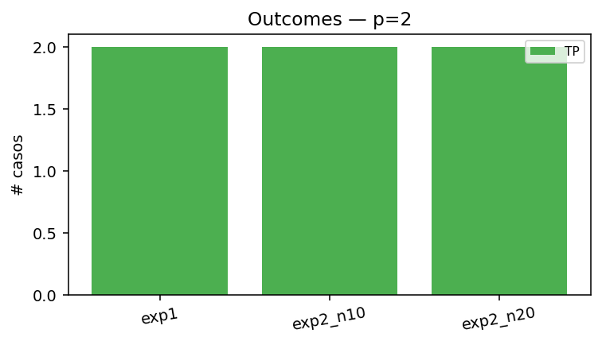

## Experimento 1 — almacenados como input

Esperamos punto fijo en 1 iteración. Si alguno NO es estable, ya excedimos la capacidad incluso sin ruido.

| letra   |   iters | motivo   | outcome   | es_fijo   |   hamming_final |   energia_inicial |   energia_final |
|:--------|--------:|:---------|:----------|:----------|----------------:|------------------:|----------------:|
| A       |       1 | stable   | TP        | True      |               0 |            -11.52 |          -11.52 |
| L       |       1 | stable   | TP        | True      |               0 |            -11.52 |          -11.52 |

### A (almacenada)

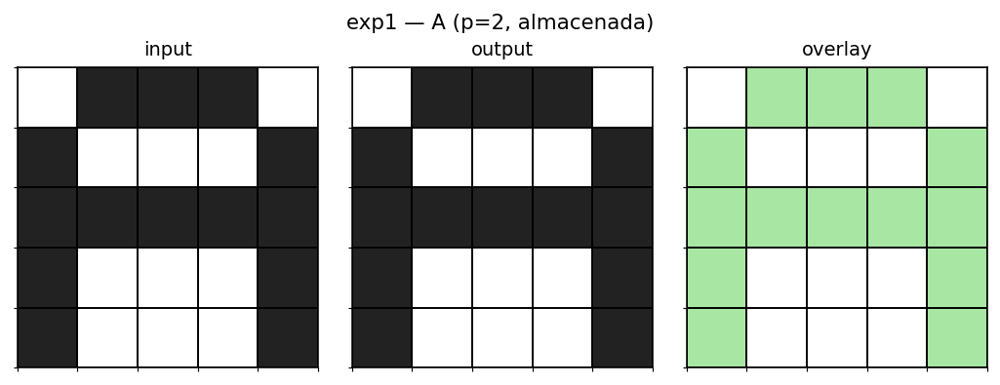

### L (almacenada)

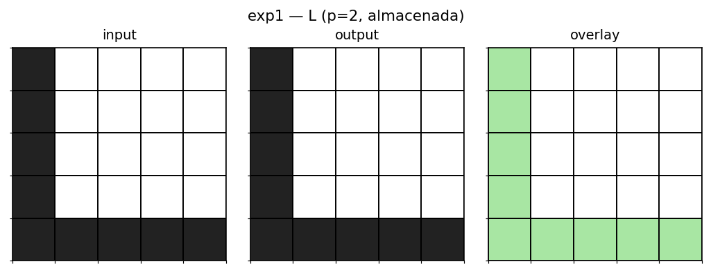

## Experimento 2 — ruido 10%

Una muestra determinística por letra (seed=1).

| letra   |   iters | motivo   | convergio_a   | outcome   |   hamming_inicial |   hamming_final |   energia_inicial |   energia_final |
|:--------|--------:|:---------|:--------------|:----------|------------------:|----------------:|------------------:|----------------:|
| A       |       2 | stable   | A             | TP        |                 1 |               0 |             -9.6  |          -11.52 |
| L       |       2 | stable   | L             | TP        |                 2 |               0 |             -7.84 |          -11.52 |

### A con ruido 10% → TP (A)

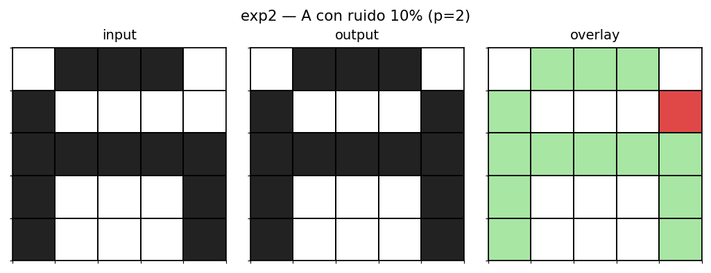

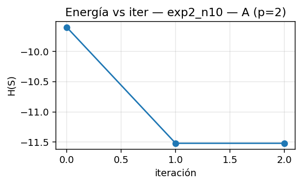 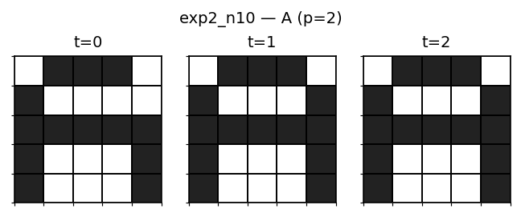

### L con ruido 10% → TP (L)

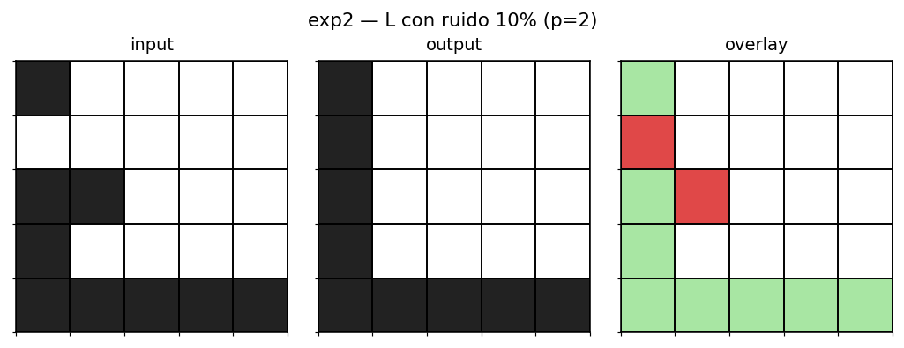

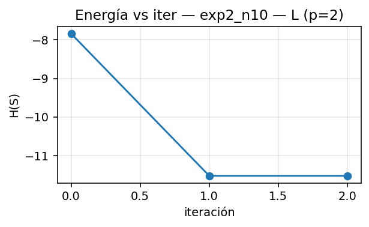 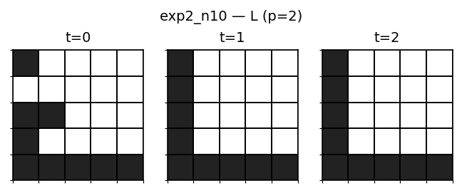

## Experimento 2 — ruido 20%

Una muestra determinística por letra (seed=1).

| letra   |   iters | motivo   | convergio_a   | outcome   |   hamming_inicial |   hamming_final |   energia_inicial |   energia_final |
|:--------|--------:|:---------|:--------------|:----------|------------------:|----------------:|------------------:|----------------:|
| A       |       2 | stable   | A             | TP        |                 5 |               0 |              -4   |          -11.52 |
| L       |       2 | stable   | L             | TP        |                 6 |               0 |              -2.4 |          -11.52 |

### A con ruido 20% → TP (A)

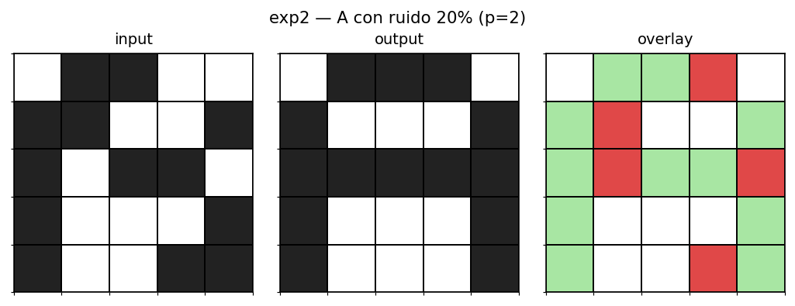

 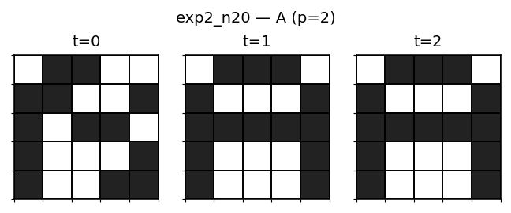

### L con ruido 20% → TP (L)

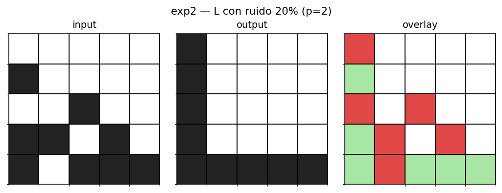

 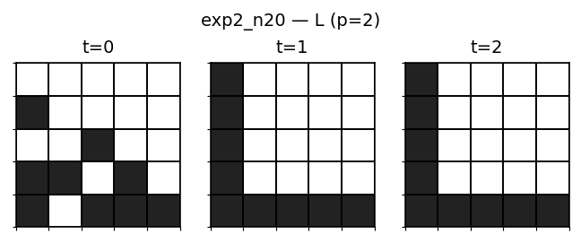
