# Capacidad p=3

```
p=3
grupo=FUY
|<,>| medio=1.000
```

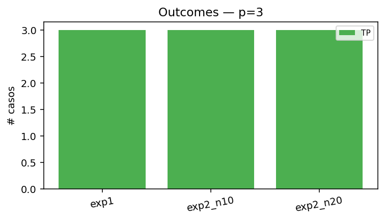

## Experimento 1 — almacenados como input

Esperamos punto fijo en 1 iteración. Si alguno NO es estable, ya excedimos la capacidad incluso sin ruido.

| letra   |   iters | motivo   | outcome   | es_fijo   |   hamming_final |   energia_inicial |   energia_final |
|:--------|--------:|:---------|:----------|:----------|----------------:|------------------:|----------------:|
| F       |       1 | stable   | TP        | True      |               0 |            -11.04 |          -11.04 |
| U       |       1 | stable   | TP        | True      |               0 |            -11.04 |          -11.04 |
| Y       |       1 | stable   | TP        | True      |               0 |            -11.04 |          -11.04 |

### F (almacenada)

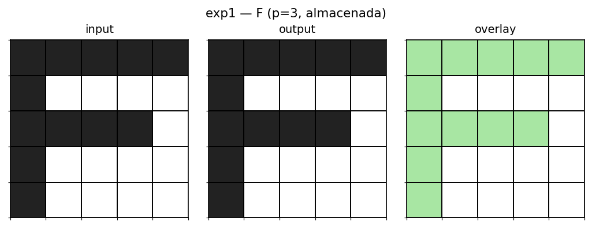

### U (almacenada)

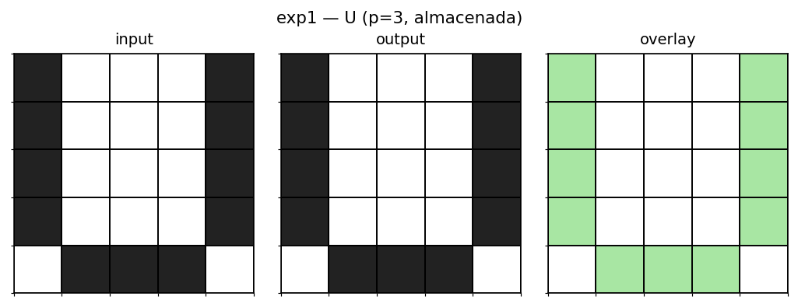

### Y (almacenada)

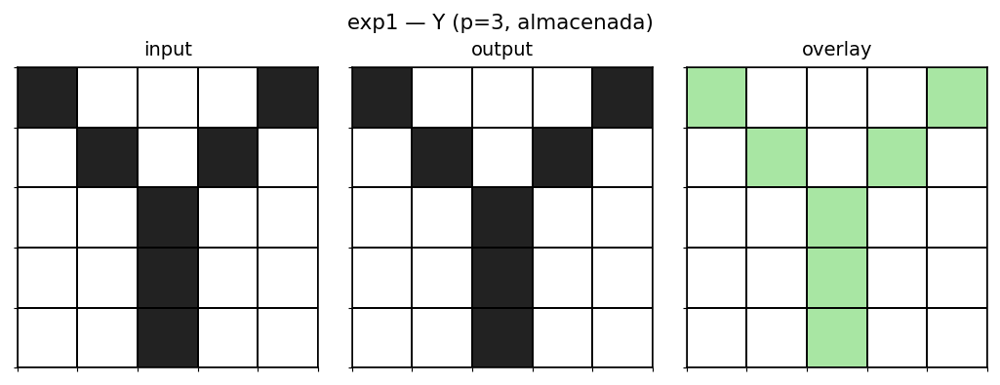

## Experimento 2 — ruido 10%

Una muestra determinística por letra (seed=1).

| letra   |   iters | motivo   | convergio_a   | outcome   |   hamming_inicial |   hamming_final |   energia_inicial |   energia_final |
|:--------|--------:|:---------|:--------------|:----------|------------------:|----------------:|------------------:|----------------:|
| F       |       2 | stable   | F             | TP        |                 1 |               0 |             -9.28 |          -11.04 |
| U       |       2 | stable   | U             | TP        |                 2 |               0 |             -7.36 |          -11.04 |
| Y       |       2 | stable   | Y             | TP        |                 1 |               0 |             -9.12 |          -11.04 |

### F con ruido 10% → TP (F)

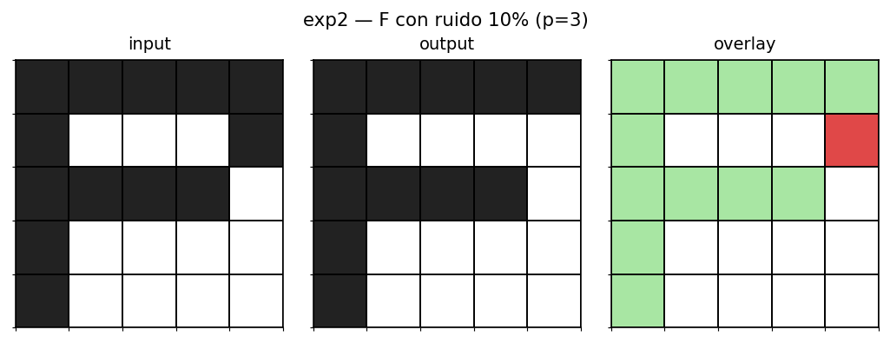

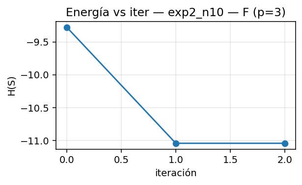 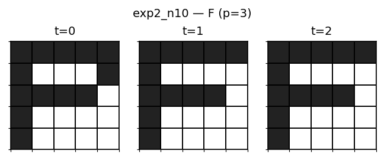

### U con ruido 10% → TP (U)

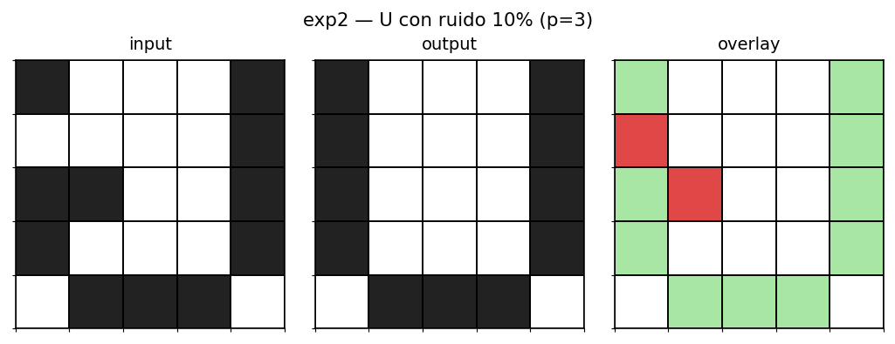

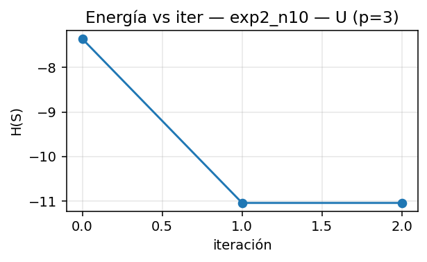 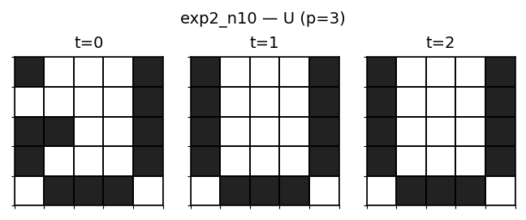

### Y con ruido 10% → TP (Y)

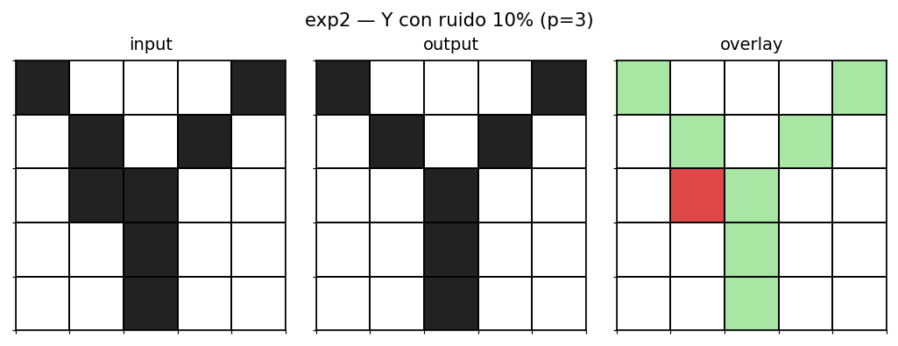

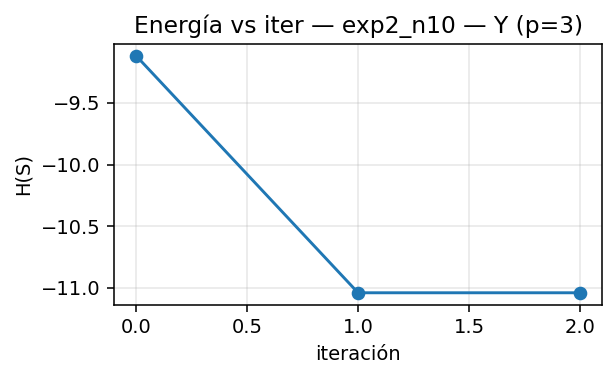 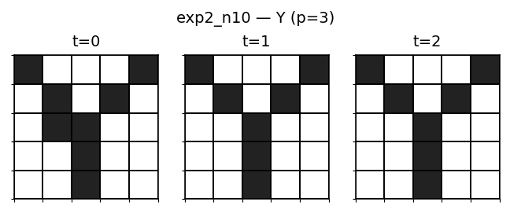

## Experimento 2 — ruido 20%

Una muestra determinística por letra (seed=1).

| letra   |   iters | motivo   | convergio_a   | outcome   |   hamming_inicial |   hamming_final |   energia_inicial |   energia_final |
|:--------|--------:|:---------|:--------------|:----------|------------------:|----------------:|------------------:|----------------:|
| F       |       2 | stable   | F             | TP        |                 5 |               0 |             -3.52 |          -11.04 |
| U       |       2 | stable   | U             | TP        |                 6 |               0 |             -2.4  |          -11.04 |
| Y       |       2 | stable   | Y             | TP        |                 4 |               0 |             -4.48 |          -11.04 |

### F con ruido 20% → TP (F)

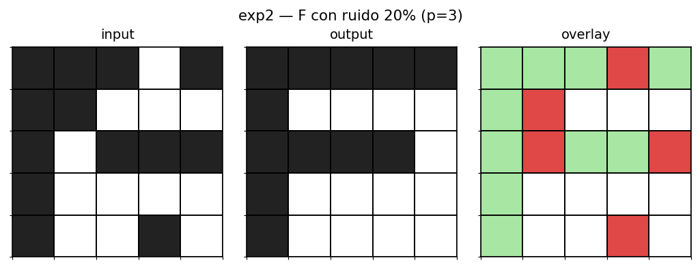

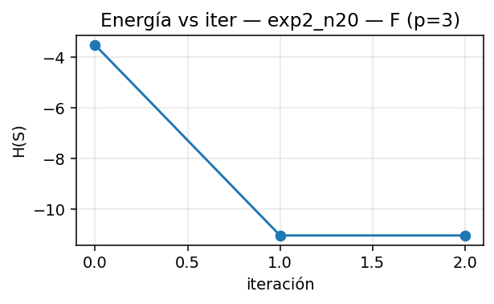 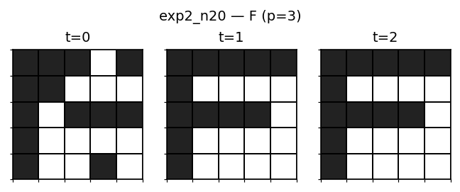

### U con ruido 20% → TP (U)

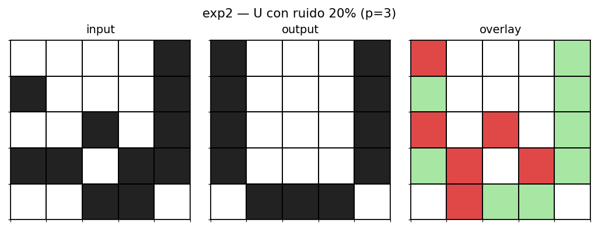

 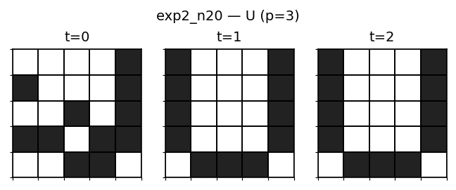

### Y con ruido 20% → TP (Y)

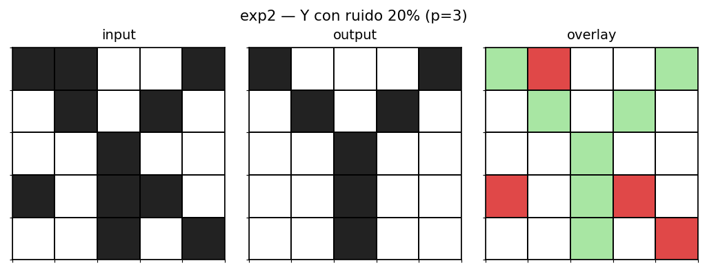

 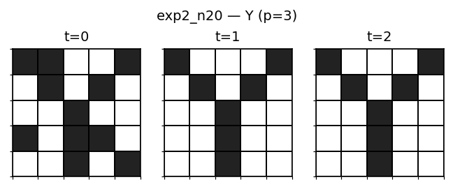
