# Capacidad p=5

```
p=5
grupo=GMPVZ
|<,>| medio=2.200
```

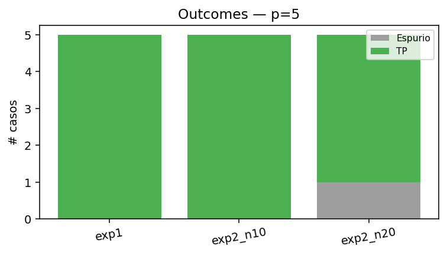

## Experimento 1 — almacenados como input

Esperamos punto fijo en 1 iteración. Si alguno NO es estable, ya excedimos la capacidad incluso sin ruido.

| letra   |   iters | motivo   | outcome   | es_fijo   |   hamming_final |   energia_inicial |   energia_final |
|:--------|--------:|:---------|:----------|:----------|----------------:|------------------:|----------------:|
| G       |       1 | stable   | TP        | True      |               0 |            -10.24 |          -10.24 |
| M       |       1 | stable   | TP        | True      |               0 |            -10.88 |          -10.88 |
| P       |       1 | stable   | TP        | True      |               0 |            -10.24 |          -10.24 |
| V       |       1 | stable   | TP        | True      |               0 |            -10.72 |          -10.72 |
| Z       |       1 | stable   | TP        | True      |               0 |            -10.56 |          -10.56 |

### G (almacenada)

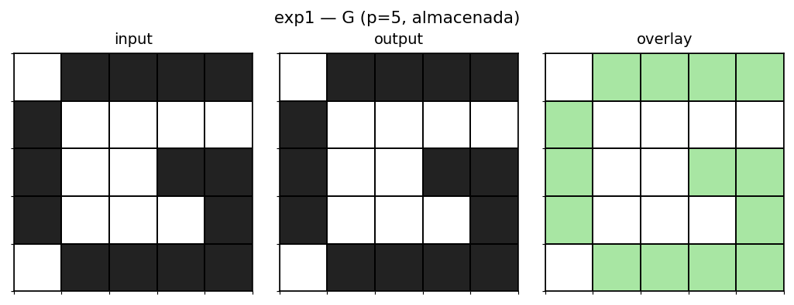

### M (almacenada)

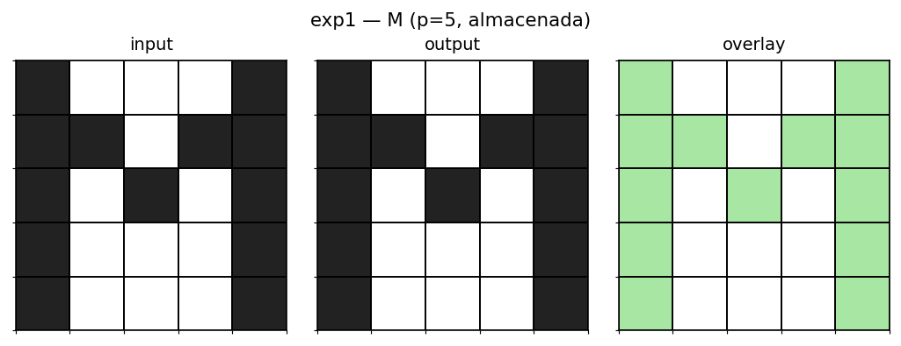

### P (almacenada)

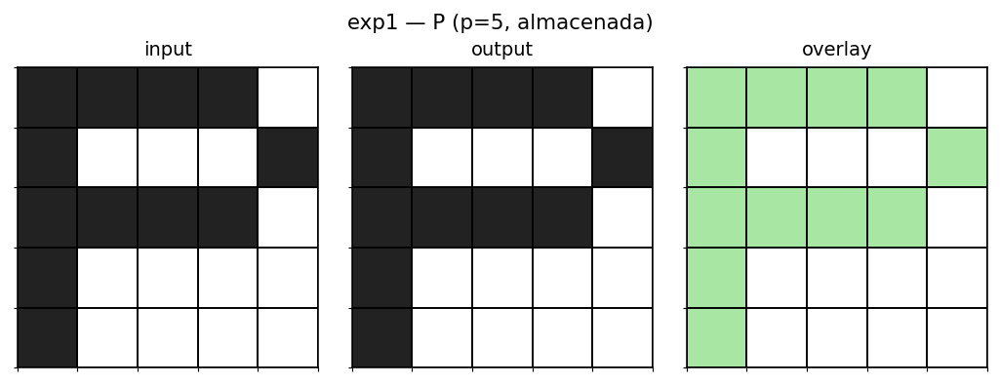

### V (almacenada)


### Z (almacenada)

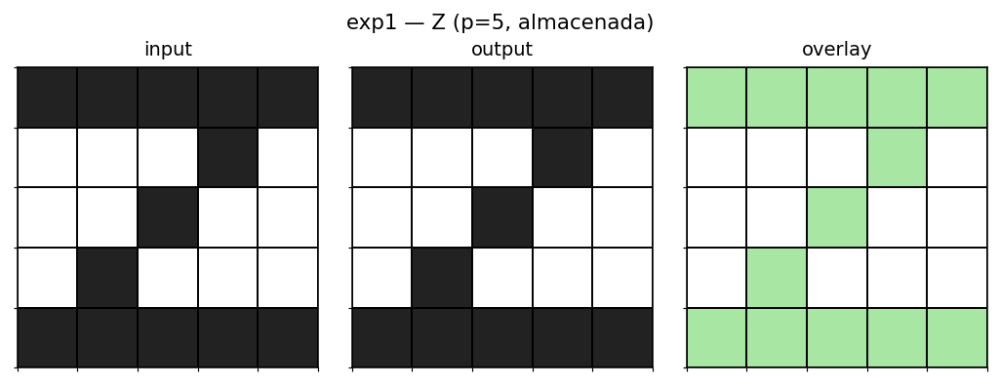

## Experimento 2 — ruido 10%

Una muestra determinística por letra (seed=1).

| letra   |   iters | motivo   | convergio_a   | outcome   |   hamming_inicial |   hamming_final |   energia_inicial |   energia_final |
|:--------|--------:|:---------|:--------------|:----------|------------------:|----------------:|------------------:|----------------:|
| G       |       2 | stable   | G             | TP        |                 1 |               0 |             -8.32 |          -10.24 |
| M       |       2 | stable   | M             | TP        |                 2 |               0 |             -7.2  |          -10.88 |
| P       |       2 | stable   | P             | TP        |                 1 |               0 |             -8.8  |          -10.24 |
| V       |       1 | stable   | V             | TP        |                 0 |               0 |            -10.72 |          -10.72 |
| Z       |       2 | stable   | Z             | TP        |                 2 |               0 |             -7.68 |          -10.56 |

### G con ruido 10% → TP (G)

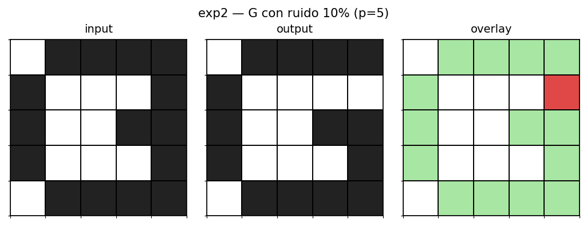

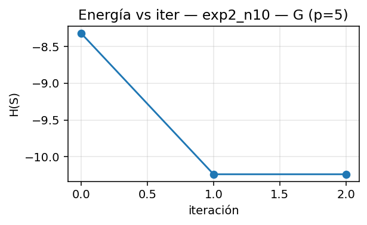 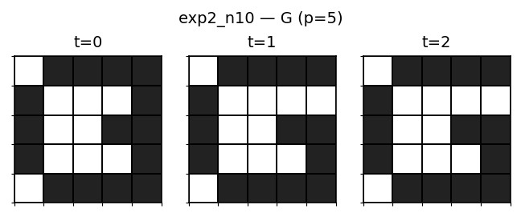

### M con ruido 10% → TP (M)

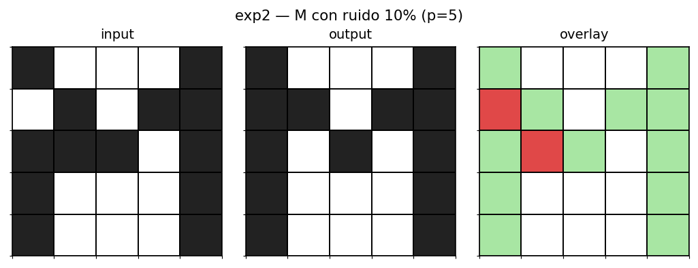

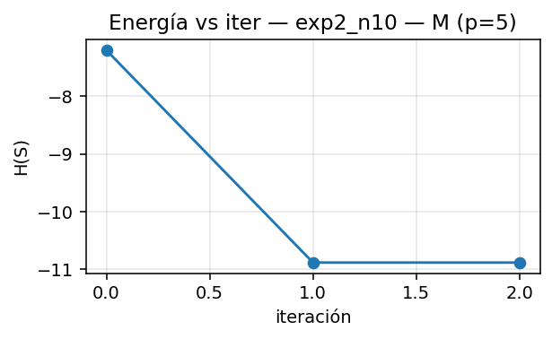 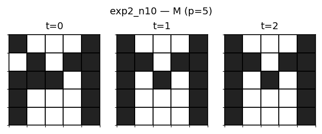

### P con ruido 10% → TP (P)

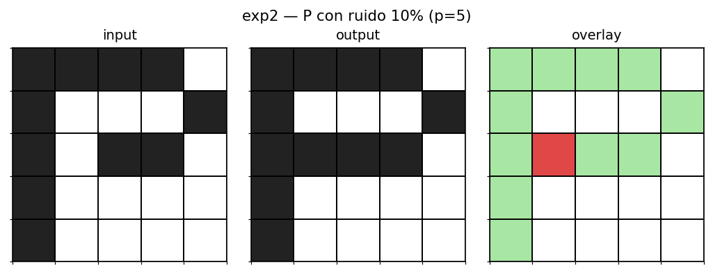

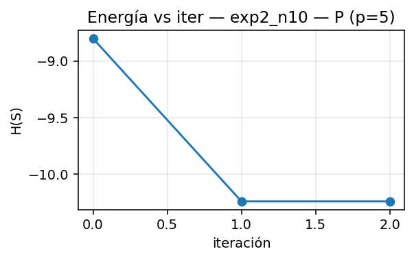 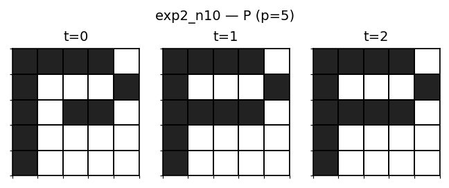

### V con ruido 10% → TP (V)

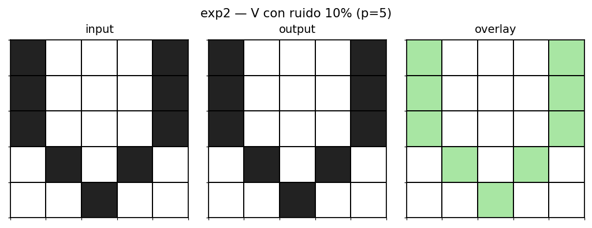

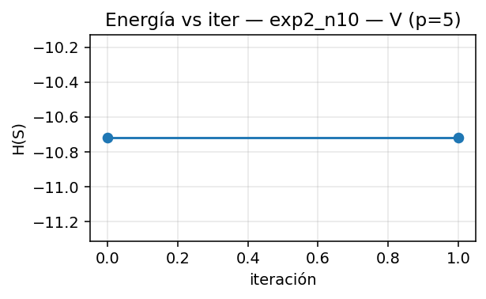 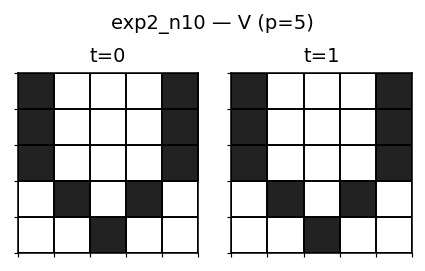

### Z con ruido 10% → TP (Z)

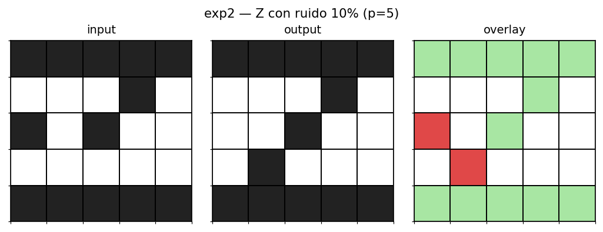

 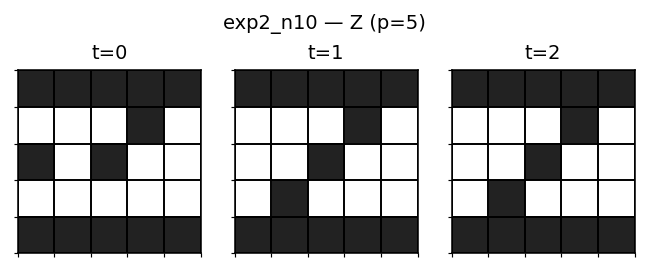

## Experimento 2 — ruido 20%

Una muestra determinística por letra (seed=1).

| letra   |   iters | motivo   | convergio_a   | outcome   |   hamming_inicial |   hamming_final |   energia_inicial |   energia_final |
|:--------|--------:|:---------|:--------------|:----------|------------------:|----------------:|------------------:|----------------:|
| G       |       2 | stable   | G             | TP        |                 5 |               0 |             -2.56 |          -10.24 |
| M       |       6 | stable   | nan           | Espurio   |                 6 |               5 |             -3.2  |           -9.92 |
| P       |       2 | stable   | P             | TP        |                 4 |               0 |             -3.84 |          -10.24 |
| V       |       3 | stable   | V             | TP        |                 4 |               0 |             -4.8  |          -10.72 |
| Z       |       3 | stable   | Z             | TP        |                 8 |               0 |              0.16 |          -10.56 |

### G con ruido 20% → TP (G)

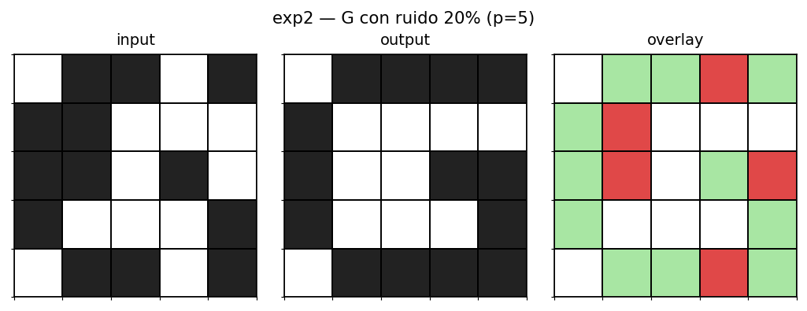

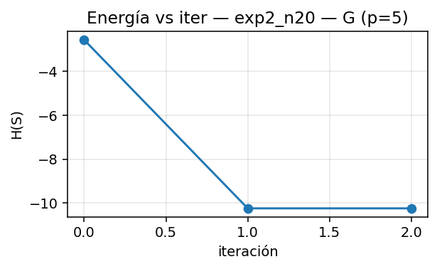 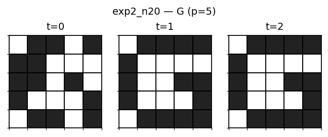

### M con ruido 20% → Espurio

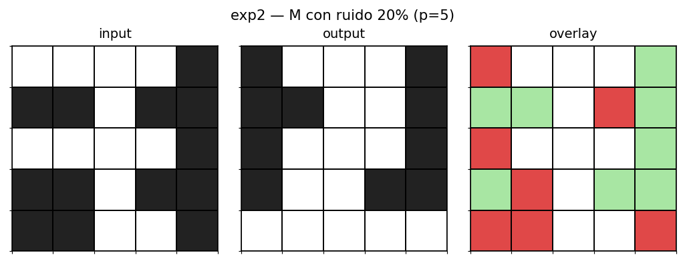

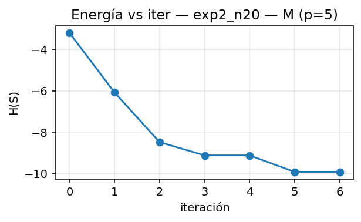 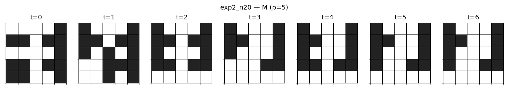

### P con ruido 20% → TP (P)

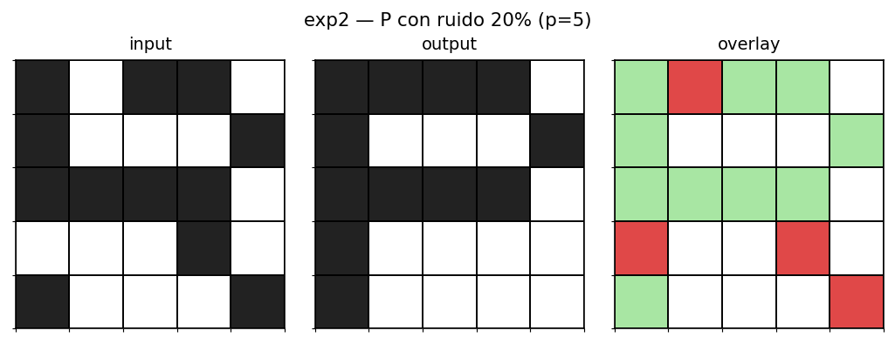

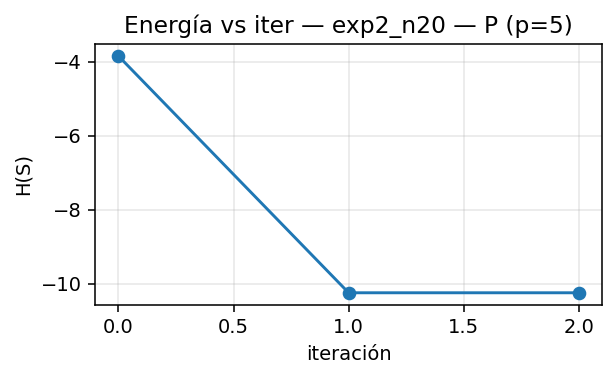 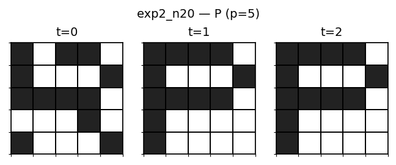

### V con ruido 20% → TP (V)

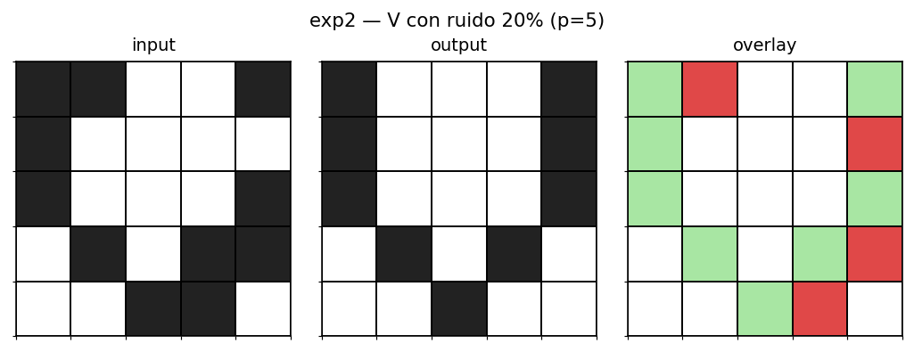

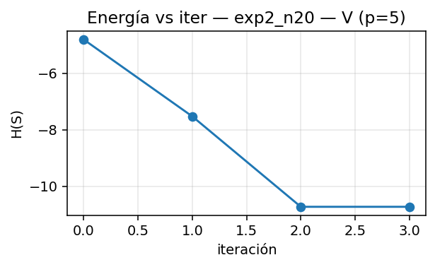 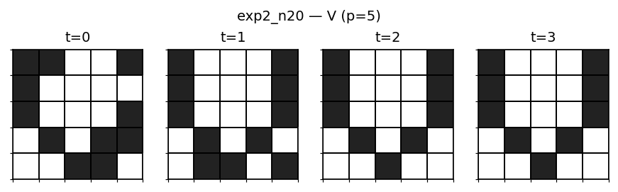

### Z con ruido 20% → TP (Z)

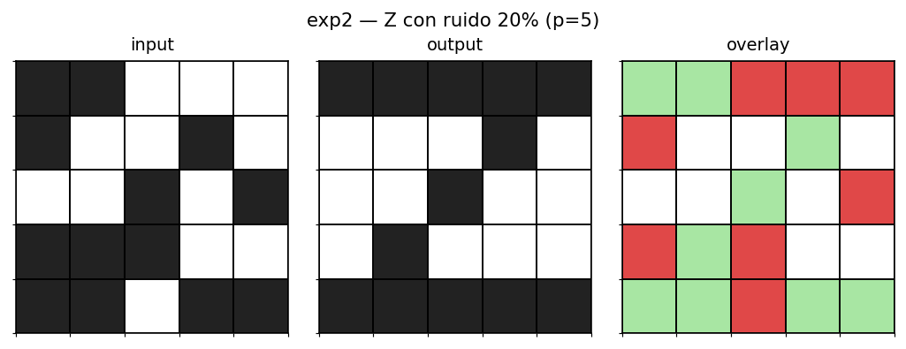

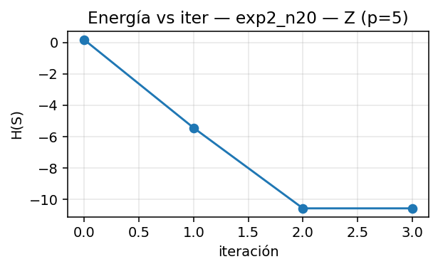 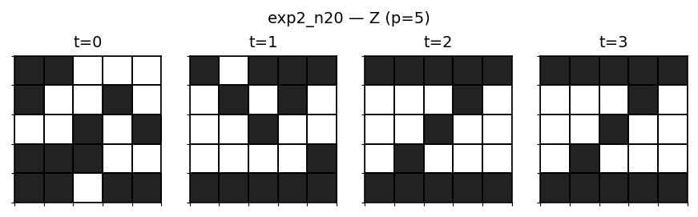
