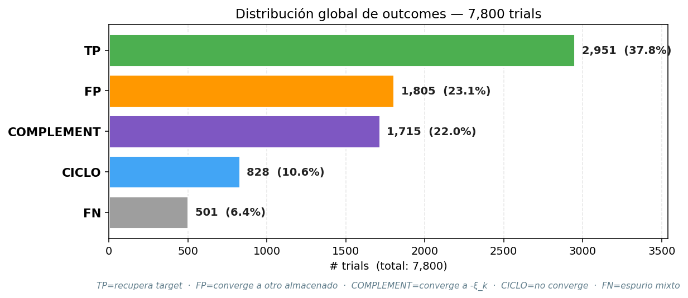
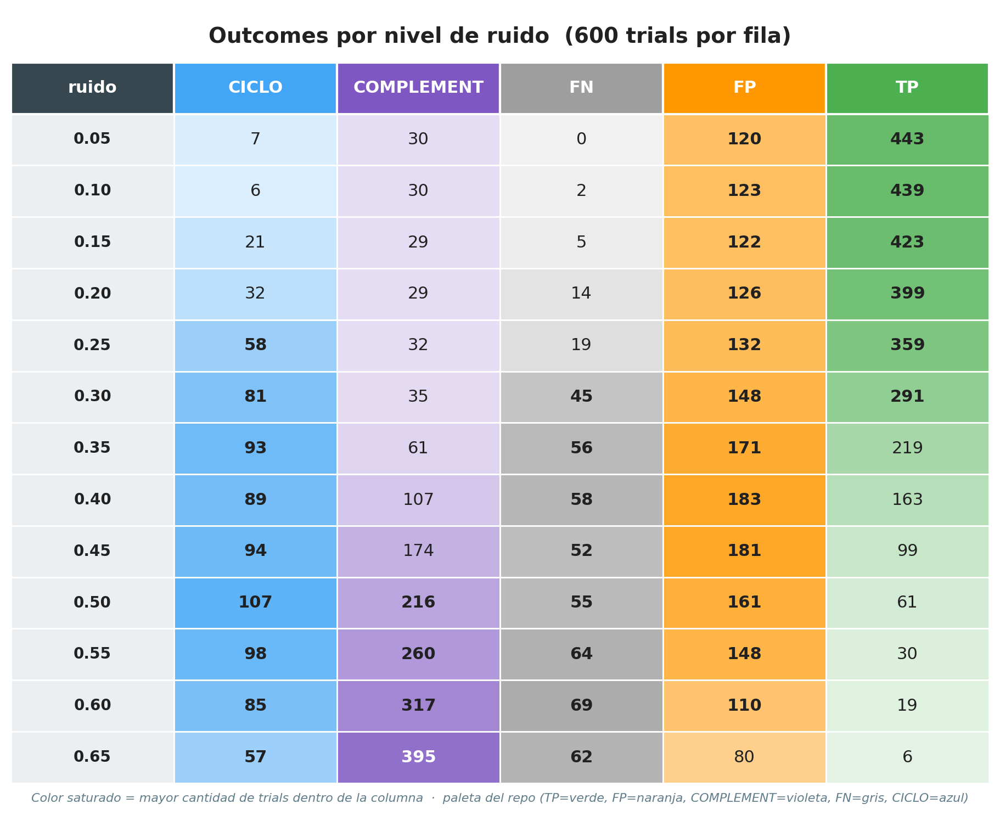
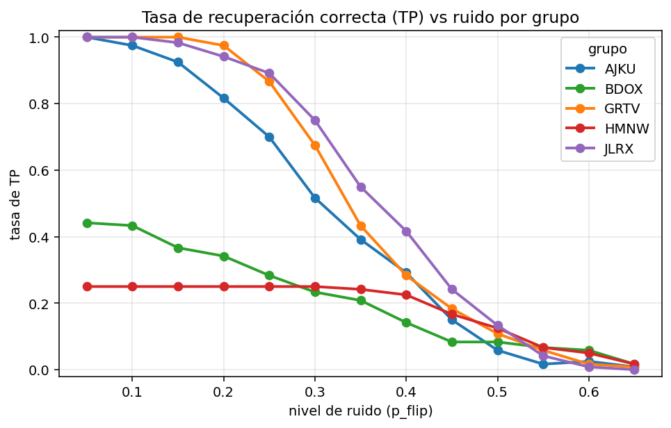
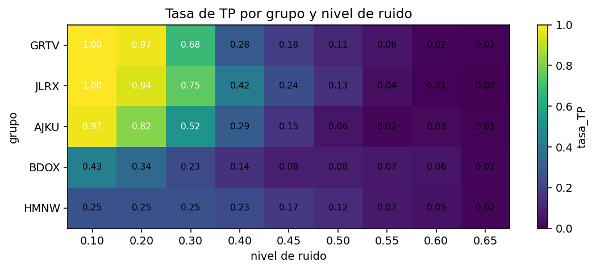
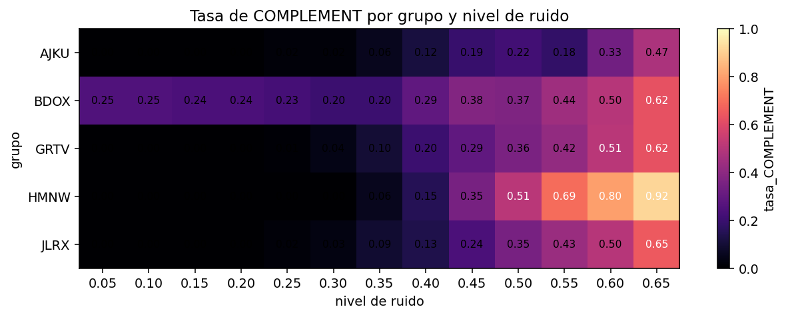
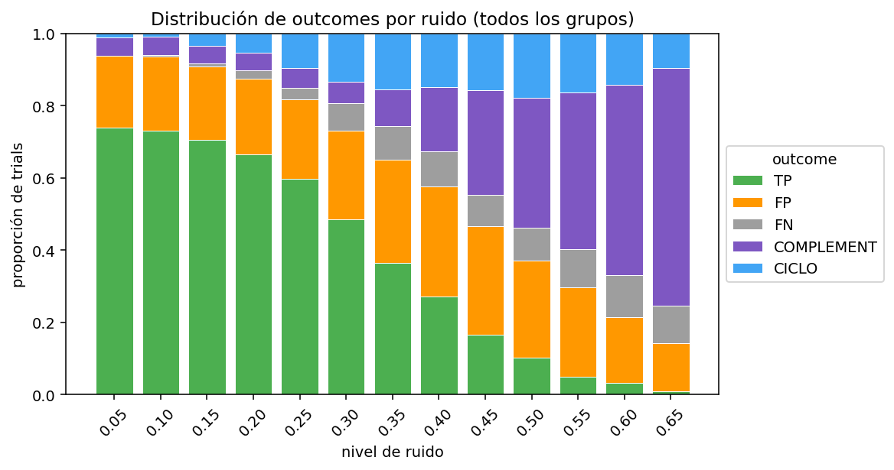
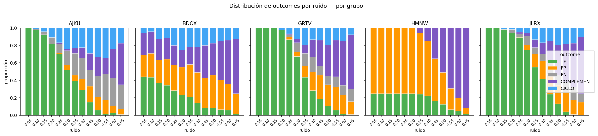
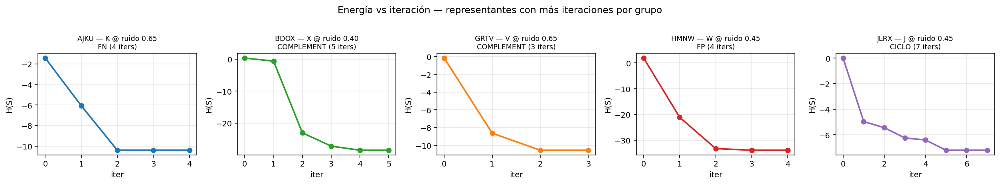

# Mega-experimento — plots y lectura de resultados

Plots generados por `hopfield/plot_mega_exp.py` desde los CSVs descritos
en [`README.md`](README.md). Todos viven en [`plots/`](plots/).

Con la extensión a 13 niveles de ruido (incluyendo 0.05, 0.15, 0.25, 0.35)
el barrido tiene **7800 trials** y la curva de TP queda resuelta con paso
uniforme de 0.05 entre 0.05 y 0.65 (paso doble entre 0.35 y 0.65 hacia el
final, donde la TP ya está colapsada y no aporta más información).

Para regenerar:

```bash
python3 hopfield/plot_mega_exp.py
```

Convención de paleta (consistente en todos los plots):

| outcome        | color    | qué pasó                                  |
| -------------- | -------- | ----------------------------------------- |
| **TP**         | verde    | Recupera el target                        |
| **FP**         | naranja  | Cae en otro patrón almacenado             |
| **COMPLEMENT** | violeta  | Cae en el complemento de algún almacenado |
| **FN**         | gris     | Estable, espurio no-clasificable          |
| **CICLO**      | azul     | No converge a punto fijo                  |

---

## 1. Vista general del experimento

Antes de entrar en las comparaciones, dos plots que resumen "qué pasó"
sobre los 7800 trials.

### Distribución global de outcomes — [`outcomes_global_bar.png`](plots/outcomes_global_bar.png)



Barras horizontales con el conteo y porcentaje de cada outcome sobre el
total de 7800 trials, ranqueadas de mayor a menor:

| outcome    |     n |     % |
| ---------- | ----: | ----: |
| TP         | 2 951 | 37.8% |
| FP         | 1 805 | 23.1% |
| COMPLEMENT | 1 715 | 22.0% |
| CICLO      |   828 | 10.6% |
| FN         |   501 |  6.4% |

**Lecturas claves**:

- TP es el outcome más frecuente (~38%), pero **NO es mayoría**: en más
  de 6 de cada 10 trials la red falla de algún modo.
- Las dos categorías más "estructuradas" (FP y COMPLEMENT) suman 45%:
  la red casi siempre cae en algún atractor reconocible (un almacenado
  o su antipodal), no en basura aleatoria.
- FN es marginal (6%) y CICLO es relativamente raro (11%) — el paisaje
  de energía está bastante poblado de atractores nítidos.

Este dato global combina todos los niveles de ruido (incluso 0.65 donde
TP es ~1%), así que el 37.8% global sub-representa lo que pasa en el
régimen útil (ruido ≤ 0.30, donde TP > 50%).

### Outcomes por nivel de ruido — [`outcomes_table_by_noise.png`](plots/outcomes_table_by_noise.png)



Tabla con los 13 niveles de ruido como filas y los 5 outcomes como
columnas (cada fila tiene 600 trials = 5 grupos × 4 letras × 30 samples).
Cada celda está tinteada por intensidad dentro de su columna — el
color saturado indica el nivel de ruido donde ese outcome es más
frecuente.

Se ve a simple vista que cada outcome tiene su "pico" en distinto
régimen:

- **TP** domina en ruido bajo (max en 0.05, decae monótono).
- **FP** crece hasta ~0.40 (la red sigue convergiendo a *algún*
  almacenado, pero la corrupción crece) y luego cae.
- **CICLO** pico en 0.50 (zona ambigua entre atractores) y baja
  hacia los extremos.
- **COMPLEMENT** explota a partir de 0.40 y domina absolutamente en
  ≥0.55.
- **FN** crece monótono pero nunca llega a dominar.

---

## 2. Comparación entre grupos

### Curvas tasa_TP vs ruido — [`tp_curves_by_group.png`](plots/tp_curves_by_group.png)



Las 5 curvas comparten la misma forma sigmoidea decreciente, pero el
**ranking se mantiene en todo el rango**: `JLRX` y `GRTV` (los grupos de
menor `|⟨,⟩| medio`) dominan a `BDOX` y `HMNW` (los grupos elegidos como
"malos") para cualquier nivel de ruido.

Con los puntos extra (0.05, 0.15, 0.25, 0.35) ahora se ven tres
regímenes claros:

- **Meseta inicial** (0.05–0.15): los grupos buenos sostienen TP ≈ 0.85–0.95;
  los malos arrancan ya por debajo del 50%. El "techo" del grupo bueno se
  alcanza incluso con ruido bajo, no es solo cuestión de empezar limpio.
- **Caída lineal** (0.20–0.45): cada 5% de ruido extra bajan ~10 pts de TP.
  La separación entre grupos buenos y malos es **máxima alrededor de
  ruido = 0.30** (40 pts entre `JLRX` y `HMNW`).
- **Colapso** (≥0.50): todos convergen a casi 0%. La calidad del grupo
  deja de importar cuando el input está más cerca del antipodal que del
  target.

**Lectura clave para la presentación**: la ortogonalidad de los patrones
no solo desplaza la curva — la hace cuantitativamente mejor en *todo* el
régimen útil, y agranda el margen útil de operación.

### Heatmap tasa_TP — [`heatmap_tp.png`](plots/heatmap_tp.png)



Misma información que las curvas pero en formato matricial con valores
anotados. Útil para citar números puntuales (`HMNW @ 0.30 = 0.18`,
`JLRX @ 0.20 = 0.93`, `JLRX @ 0.05 = 0.98`).

### Heatmap tasa_COMPLEMENT — [`heatmap_complement.png`](plots/heatmap_complement.png)



El "espejo" del heatmap de TP: a medida que TP cae, COMPLEMENT crece.
Los grupos malos (`BDOX`, `HMNW`) tienen tasas de COMPLEMENT altas
incluso a ruido moderado (0.30-0.40), mientras que los grupos buenos
"resisten" la atracción al antipodal por más tiempo. A ruido 0.65 todos
los grupos están dominados por COMPLEMENT (≥60%).

---

## 3. Distribución completa de outcomes por grupo

### Global — [`outcomes_stacked_global.png`](plots/outcomes_stacked_global.png)



Barras apiladas con las 5 categorías para cada nivel de ruido (13
barras), agregando todos los grupos. A ruido bajo (≤0.20) dominan TP y
FP; el FP indica que la red **sí está convergiendo a un patrón
almacenado**, solo que no es el target — un fallo "menos malo" que el
espurio. A ruido alto (≥0.45) domina COMPLEMENT, no FN: la red sigue
convergiendo a algo que se parece estructuralmente a un almacenado (su
antipodal), no a basura total.

CICLO es máximo cerca del centro (0.40–0.55), donde el input está
"justo entre dos atractores" y la red oscila. A ruido muy alto el
input cae directo en el antipodal estable y CICLO baja otra vez.

### Por grupo — [`outcomes_stacked_by_group.png`](plots/outcomes_stacked_by_group.png)



Mismas barras apiladas pero descompuestas por grupo. Se ve claramente
que:

- `JLRX` casi nunca produce FP — sus 4 letras son distinguibles aunque
  el input esté muy corrupto.
- `HMNW` y `BDOX` empiezan a tener FP desde ruido bajo (la red confunde
  letras parecidas incluso con poco ruido).
- `AJKU` es un caso interesante: relativamente pocos FP pero muchos FN
  (espurios mixtos) — sus patrones son distintos pero el paisaje de
  energía es rugoso y tiene muchos atractores espurios no-antipodales.

---

## 4. Por grupo: outcomes por letra

Cada grupo tiene su propio plot mostrando las 4 letras almacenadas como
columnas, cada una con su barra apilada por ruido (13 barras). Permite
ver **asimetrías dentro del grupo** — si una letra particular es más
fácil o más difícil de recuperar.

| grupo | plot                                                              |
| ----- | ----------------------------------------------------------------- |
| GRTV  | [`GRTV_outcomes_by_letter.png`](plots/GRTV_outcomes_by_letter.png) |
| JLRX  | [`JLRX_outcomes_by_letter.png`](plots/JLRX_outcomes_by_letter.png) |
| AJKU  | [`AJKU_outcomes_by_letter.png`](plots/AJKU_outcomes_by_letter.png) |
| BDOX  | [`BDOX_outcomes_by_letter.png`](plots/BDOX_outcomes_by_letter.png) |
| HMNW  | [`HMNW_outcomes_by_letter.png`](plots/HMNW_outcomes_by_letter.png) |

Ej. en `HMNW` la letra `N` se recupera bastante mejor que `M`/`W`,
porque `N` es la que tiene producto interno más bajo con las otras tres.

---

## 5. Grillas de overlays input/output

Una imagen por grupo con las 4 letras × **13 niveles de ruido** del
trial **representante** (sample_idx=0). Cada celda muestra el overlay del
input con el output:

- **Verde claro** = pixel `+1` en input y output (acierto en pixel encendido).
- **Blanco** = pixel `-1` en input y output (acierto en pixel apagado).
- **Rojo** = mismatch — la red flippeó ese pixel respecto al input.

Bajo cada celda se anota el outcome resultante (`TP`, `FP`, etc.) y el
patrón al que convergió (cuando aplica).

| grupo | plot                                                |
| ----- | --------------------------------------------------- |
| GRTV  | [`GRTV_overlay_grid.png`](plots/GRTV_overlay_grid.png) |
| JLRX  | [`JLRX_overlay_grid.png`](plots/JLRX_overlay_grid.png) |
| AJKU  | [`AJKU_overlay_grid.png`](plots/AJKU_overlay_grid.png) |
| BDOX  | [`BDOX_overlay_grid.png`](plots/BDOX_overlay_grid.png) |
| HMNW  | [`HMNW_overlay_grid.png`](plots/HMNW_overlay_grid.png) |

**Atención**: estos son los representantes (un solo sample por config),
no la mayoría estadística. Sirven para *ilustrar* cómo se ve un trial
particular pero no son representativos del grupo en sentido estadístico
— para eso ver las distribuciones de outcomes de la sección anterior.

### Outcome de los 260 representantes (1 por config)

| grupo | TP | FP | COMPLEMENT | FN | CICLO |
| ----- | -: | -: | ---------: | -: | ----: |
| AJKU  | 24 |  0 |          6 | 20 |     2 |
| BDOX  | 14 | 15 |         17 |  0 |     6 |
| GRTV  | 22 | 11 |         12 |  4 |     3 |
| HMNW  |  9 | 25 |         18 |  0 |     0 |
| JLRX  | 30 |  0 |         12 |  4 |     6 |

`JLRX` y `GRTV` dominan TP entre los representantes; `HMNW` tiene la
particularidad de no producir ningún FN ni CICLO — siempre estabiliza
en un patrón "estructurado" (almacenado o complemento), aunque
frecuentemente equivocado.

---

## 6. Trayectorias de energía

[`energy_longest_per_group.png`](plots/energy_longest_per_group.png) —
para cada grupo elegí el representante que **más iteraciones tardó** en
estabilizarse, y grafico su `H(S)` vs iteración.



Sirve como ejemplo concreto del comportamiento "energía siempre
decrece" (en realidad: nunca crece) de Hopfield. Las curvas son
monótonas no-crecientes, llegando al mínimo local correspondiente al
atractor donde la red se asentó.

---

## Resumen: qué plots usar en la presentación

Priorizando por valor expositivo:

1. **`outcomes_global_bar.png`** — abre con la foto general: "qué hace
   Hopfield en este experimento" en una sola figura.
2. **`tp_curves_by_group.png`** — el plot money: muestra que la elección de
   grupo importa, que el ruido degrada gradualmente, y los tres regímenes
   (meseta / caída / colapso).
3. **`outcomes_table_by_noise.png`** — la tabla coloreada muestra de un
   vistazo *dónde* gana cada outcome a lo largo del rango de ruido.
4. **`outcomes_stacked_by_group.png`** — descomposición por grupo: por qué
   falla la red, no solo cuánto falla.
5. **Un `<grupo>_overlay_grid.png`** del peor grupo (`HMNW`) — visual,
   muestra el "flip al complemento" emergiendo a ruido alto.
6. **`heatmap_tp.png`** si necesitás citar números puntuales.
7. **`energy_longest_per_group.png`** si querés mostrar la propiedad de
   energía decreciente.

Los `<grupo>_outcomes_by_letter.png` son útiles si querés profundizar en
asimetrías intra-grupo durante el Q&A.
