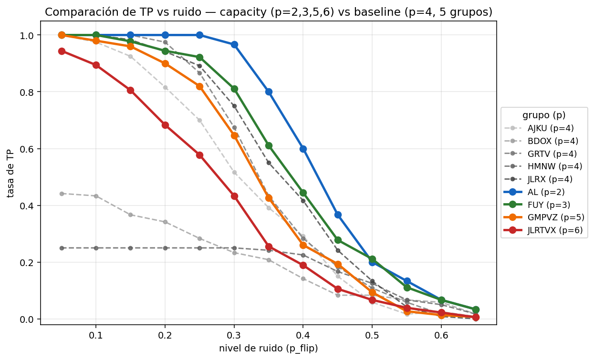
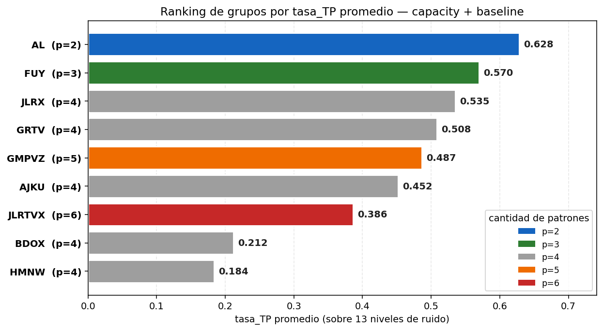
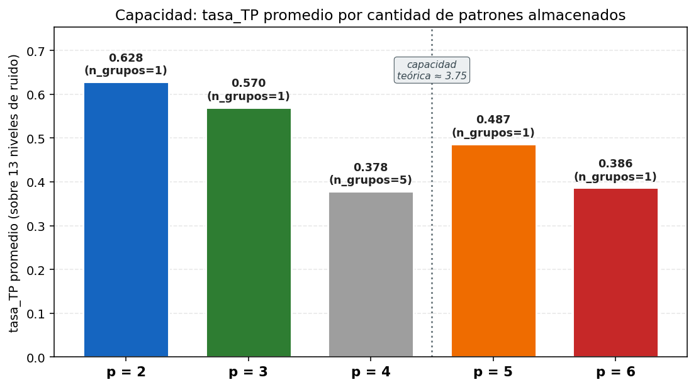
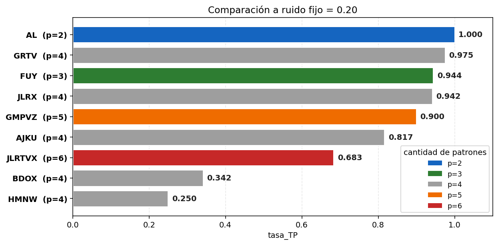

# Mega-experimento capacity — plots y comparación con el baseline (p=4)

Plots generados por `hopfield/plot_mega_exp.py` y por
`hopfield/plot_capacity_comparison.py` desde los CSVs descritos en
[`README.md`](README.md). Todos viven en [`plots/`](plots/).

Para regenerar:

```bash
python3 hopfield/plot_mega_exp.py --input hopfield/output/mega_exp_capacity
python3 hopfield/plot_capacity_comparison.py
```

Convención de paleta (consistente con el resto del repo):

| outcome        | color    | qué pasó                                  |
| -------------- | -------- | ----------------------------------------- |
| **TP**         | verde    | Recupera el target                        |
| **FP**         | naranja  | Cae en otro patrón almacenado             |
| **COMPLEMENT** | violeta  | Cae en el complemento de algún almacenado |
| **FN**         | gris     | Estable, espurio no-clasificable          |
| **CICLO**      | azul     | No converge a punto fijo                  |

Y para los plots de comparación, además, color por valor de `p`:

| p | color           |
| - | --------------- |
| 2 | azul oscuro     |
| 3 | verde oscuro    |
| 4 | gris (baseline) |
| 5 | naranja         |
| 6 | rojo            |

---

## 1. Comparación cross-experimento — capacity vs baseline

Esta es la parte nueva. Los 4 plots `comparison_*.png` combinan los CSVs
de `mega_exp/` (5 grupos p=4) y `mega_exp_capacity/` (4 grupos p=2,3,5,6)
para responder la pregunta: **¿cuánto importa la cantidad de patrones
vs. la calidad del grupo elegido?**

### TP curves overlay — [`comparison_tp_curves_all.png`](plots/comparison_tp_curves_all.png)



Los 9 grupos en un mismo plot. Los baseline (p=4) van en líneas grises
punteadas, los capacity en líneas gruesas coloreadas por `p`.

**Lecturas claves**:

- `AL` (p=2, azul oscuro) está **literalmente arriba de todo** en todo el
  rango ≤ 0.30. Pequeño grupo perfectamente ortogonal → casi nada falla.
- `JLRTVX` (p=6, rojo) está **abajo del mejor p=4** (JLRX) pero **arriba
  del peor p=4** (HMNW, BDOX). O sea: 6 patrones bien elegidos > 4
  patrones mal elegidos.
- `GMPVZ` (p=5, naranja) y `FUY` (p=3, verde) cruzan el promedio del
  baseline. La cantidad de patrones no domina sobre la calidad.

### Ranking por TP promedio — [`comparison_mean_tp_by_group.png`](plots/comparison_mean_tp_by_group.png)



Promedio de `tasa_TP` sobre los 13 niveles de ruido para cada uno de los
9 grupos, ordenados de mejor a peor:

| ranking | grupo  |  p | tasa_TP promedio |
| ------: | ------ | -: | ---------------: |
|       1 | AL     |  2 |            0.628 |
|       2 | FUY    |  3 |            0.570 |
|       3 | JLRX   |  4 |            0.535 |
|       4 | GRTV   |  4 |            0.508 |
|       5 | GMPVZ  |  5 |            0.487 |
|       6 | AJKU   |  4 |            0.452 |
|       7 | JLRTVX |  6 |            0.386 |
|       8 | BDOX   |  4 |            0.212 |
|       9 | HMNW   |  4 |            0.184 |

**El insight central del trabajo está acá**: el ranking no es monótono en
`p`. `GMPVZ` (p=5) supera a `AJKU` (p=4) y bastante a `BDOX`/`HMNW`
(p=4). Y `JLRTVX` (p=6) es mejor que los dos p=4 peores. **La
ortogonalidad del grupo puede ganarle a la cantidad de patrones**.

### Por valor de p — [`comparison_mean_tp_by_p.png`](plots/comparison_mean_tp_by_p.png)



Promedio agregado por valor de `p`, con la capacidad teórica de Hopfield
(`~0.15·N = 3.75` para N=25) marcada como referencia.

**Atención metodológica**: la columna `p=4` agrega 5 grupos (3 buenos +
2 deliberadamente malos), mientras que las otras `p` tienen un solo
grupo cuidadosamente elegido por ortogonalidad. Por eso `p=4` sale
**peor** en promedio que `p=5` y `p=6` — no porque tener 4 patrones sea
peor, sino porque el muestreo de p=4 incluye casos malos a propósito.

Si miramos solo los **mejores** de cada p:

| p | mejor grupo | tasa_TP |
| - | ----------- | ------: |
| 2 | AL          |   0.628 |
| 3 | FUY         |   0.570 |
| 4 | JLRX        |   0.535 |
| 5 | GMPVZ       |   0.487 |
| 6 | JLRTVX      |   0.386 |

Ahí sí: decaimiento monótono con `p`. La capacidad teórica de Hopfield
predice una caída brusca a partir de ~3.75, y los datos lo confirman:
entre p=3 y p=4 hay caída moderada, entre p=4 y p=5 también, pero entre
p=5 y p=6 la pendiente se acentúa.

### A ruido fijo = 0.20 — [`comparison_tp_at_noise20.png`](plots/comparison_tp_at_noise20.png)



Punto puntual en la curva: tasa_TP para cada grupo cuando el input
tiene 20% de ruido. Sirve como métrica de "robustez razonable":

| grupo  |  p | tasa_TP @ 0.20 |
| ------ | -: | -------------: |
| AL     |  2 |          1.000 |
| GRTV   |  4 |          0.975 |
| FUY    |  3 |          0.944 |
| JLRX   |  4 |          0.942 |
| GMPVZ  |  5 |          0.900 |
| AJKU   |  4 |          0.817 |
| JLRTVX |  6 |          0.683 |
| BDOX   |  4 |          0.342 |
| HMNW   |  4 |          0.250 |

A ruido moderado, los 4 mejores grupos (cualquiera de p=2,3,4,5) están
todos arriba del 90% — la capacidad no se hace sentir todavía. La
separación es enorme entre los buenos p=4 y los malos p=4 (75 pts entre
GRTV y HMNW), mientras que entre p=2 y p=5 (mejores de su categoría)
solo hay 10 pts.

---

## 2. Plots del experimento mismo (sin comparación)

Igual que en el mega-experimento original, pero con los 4 grupos
capacity. Sin volver a explicar la convención, dejo solo los enlaces.

### Vista general

- [`outcomes_global_bar.png`](plots/outcomes_global_bar.png) — distribución global de outcomes en los 6240 trials.
- [`outcomes_table_by_noise.png`](plots/outcomes_table_by_noise.png) — tabla coloreada outcome × ruido.

### Comparación entre grupos del experimento

- [`tp_curves_by_group.png`](plots/tp_curves_by_group.png) — curvas TP vs ruido por grupo.
- [`heatmap_tp.png`](plots/heatmap_tp.png) — heatmap tasa_TP (grupos × ruidos).
- [`heatmap_complement.png`](plots/heatmap_complement.png) — heatmap tasa_COMPLEMENT.
- [`outcomes_stacked_global.png`](plots/outcomes_stacked_global.png) — outcomes apilados por ruido (agregado).
- [`outcomes_stacked_by_group.png`](plots/outcomes_stacked_by_group.png) — outcomes apilados por (grupo, ruido), 4 paneles.

### Por grupo

| grupo  |  p | outcomes por letra | overlay grid |
| ------ | -: | ------------------ | ------------ |
| AL     |  2 | [`AL_outcomes_by_letter.png`](plots/AL_outcomes_by_letter.png) | [`AL_overlay_grid.png`](plots/AL_overlay_grid.png) |
| FUY    |  3 | [`FUY_outcomes_by_letter.png`](plots/FUY_outcomes_by_letter.png) | [`FUY_overlay_grid.png`](plots/FUY_overlay_grid.png) |
| GMPVZ  |  5 | [`GMPVZ_outcomes_by_letter.png`](plots/GMPVZ_outcomes_by_letter.png) | [`GMPVZ_overlay_grid.png`](plots/GMPVZ_overlay_grid.png) |
| JLRTVX |  6 | [`JLRTVX_outcomes_by_letter.png`](plots/JLRTVX_outcomes_by_letter.png) | [`JLRTVX_overlay_grid.png`](plots/JLRTVX_overlay_grid.png) |

### Energía

- [`energy_longest_per_group.png`](plots/energy_longest_per_group.png) — trayectoria de energía del representante más lento de cada grupo.

---

## Resumen: qué plots usar en la presentación

Si vas a hablar de **capacidad**, estos 3 cuentan toda la historia:

1. **`comparison_mean_tp_by_group.png`** — el ranking de los 9 grupos
   demuestra que la ortogonalidad le puede ganar a la cantidad.
2. **`comparison_tp_curves_all.png`** — visualmente potente: AL arriba
   de todo, los baseline malos al fondo.
3. **`comparison_mean_tp_by_p.png`** — si querés mostrar la capacidad
   teórica como referencia y el "el mejor de cada p" baja con p.

Para complementar con la historia del baseline, ver
[`../mega_exp/README_resultados_plots.md`](../mega_exp/README_resultados_plots.md).
