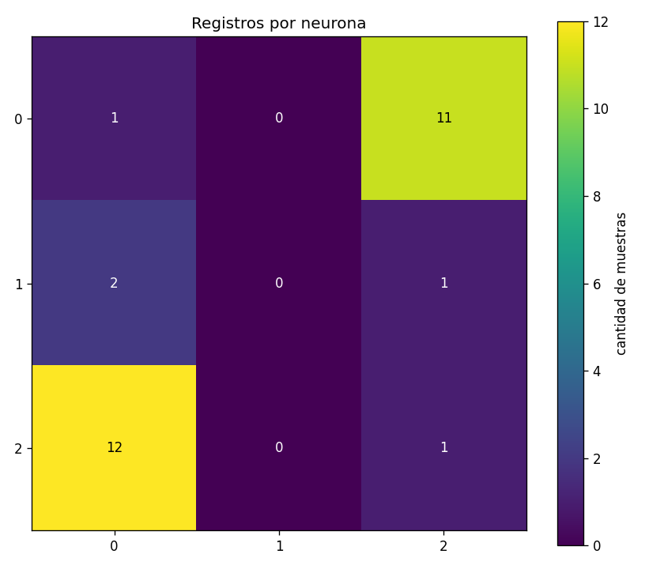

# Barrido de K — SOM sobre europe.csv

Comparativa para decidir el tamaño de grilla del SOM. Acá está el "qué cambia y qué no", los resultados crudos del barrido y la lectura que hicimos. Pensado para sentarse con alguien y discutirlo viendo los plots.

## Setup

- **Dataset:** `SIA-PCA/europe.csv`, N = 28 países, 7 variables estandarizadas con z-score.
- **Lo único que varía:** `K ∈ {2, 3, 4}`.
- **Todo lo demás fijo** (defaults coherentes con el material de cátedra):
  - grilla rectangular,
  - radio adaptativo `R(0) = K → R = 1` (lineal),
  - learning rate adaptativo `η(i) = 0.5 / i`,
  - inicialización de pesos por muestras del set (mitiga neuronas muertas),
  - `500·N = 14 000` iteraciones,
  - **10 semillas** por K para promediar y reportar dispersión.

Más arriba de K=4 ya no tiene sentido en este dataset: con K=5 son 25 celdas para 28 países y con K=6 ya hay más celdas que países (ver `kohonen.md`).

> Nota metodológica: como el SOM es estocástico (muestra aleatoria en cada paso + inicialización aleatoria), reportar una sola corrida por K es engañoso. Por eso vamos con 10 semillas y miramos media ± std.

## Métricas

- **QE (error de cuantización):** distancia euclídea media entre cada país y el peso de su BMU. Cuanto más chica, mejor representa la red al dataset.
- **% neuronas muertas:** fracción de celdas de la grilla a las que no cae *ningún* país. Es la señal clave de "K demasiado grande": si la grilla queda picada de huecos, el agrupamiento es ruido.
- **Distancia BMU por país:** además del promedio, guardamos la distancia individual de cada país a su BMU. Sirve para ver *qué países son outliers* (siempre lejos de cualquier neurona, sin importar K) vs cuáles mejoran al agrandar la grilla.

## Resumen por K

Tabla generada automáticamente — fuente: `resumen_por_K.csv`.

| K   | total neuronas | QE (media) | QE (std) | neuronas muertas (media) | % muertas (media) | % muertas (std) |
| --- | -------------: | ---------: | -------: | -----------------------: | ----------------: | --------------: |
| 2   |              4 |  **2.323** |    0.005 |                  1.2 / 4 |         **30.0%** |           19.7% |
| 3   |              9 |  **2.103** |    0.013 |                  3.2 / 9 |         **35.6%** |           10.2% |
| 4   |             16 |  **1.987** |    0.054 |                 8.0 / 16 |         **50.0%** |            7.2% |

Plot: `qe_y_dead_vs_k.png`.

### Lectura

- **QE baja muy poco al subir K.** De K=2 a K=4 cae apenas de 2.32 a 1.99 (~14%). El grueso de la mejora se da entre K=2 y K=3; pasar a K=4 mejora poco.
- **% de neuronas muertas explota.** En K=4 la mitad de la grilla está vacía en promedio. Eso es exactamente el "K demasiado grande" que muestra el profe en clase (`kohonen.md`, sec. Visualización).
- **K=2 también pierde una neurona** (30% muertas = 1.2 de 4): la grilla 2×2 es tan chica que el algoritmo termina aplastando todo en una sola fila (ver `paises_K2.txt`).
- **K=3 queda en el medio** y se ve consistente entre semillas (std baja en QE y % muertas).

**Conclusión rápida:** K=3 es el mejor compromiso para este dataset. Da topología no trivial, QE casi tan bueno como K=4, y aunque tiene ~3 celdas muertas, las que sobreviven cuentan una historia interpretable (ver sección Países por neurona).

## Distancia BMU por país

Para cada país: distancia a su BMU promediada sobre las 10 semillas. Tabla ordenada por la distancia con K=4 (los peor representados arriba). Fuente: `distancias_por_pais.csv`. Plot: `distancias_por_pais.png`.

| País | K=2 | K=3 | K=4 | Δ (K=2 − K=4) |
|---|---:|---:|---:|---:|
| Ukraine | 5.651 | 5.393 | 5.154 | 0.497 |
| Luxembourg | 4.206 | 3.865 | 3.638 | 0.568 |
| Greece | 3.815 | 3.684 | 3.612 | 0.203 |
| Spain | 3.641 | 3.602 | 3.581 | 0.060 |
| Switzerland | 3.473 | 3.097 | 2.812 | 0.661 |
| Ireland | 2.604 | 2.412 | 2.321 | 0.283 |
| Bulgaria | 2.850 | 2.467 | 2.216 | 0.634 |
| Iceland | 2.557 | 2.314 | 2.204 | 0.353 |
| Norway | 2.732 | 2.390 | 2.180 | 0.552 |
| Latvia | 2.631 | 2.267 | 2.046 | 0.585 |
| Croatia | 2.429 | 2.152 | 2.036 | 0.393 |
| United Kingdom | 2.041 | 2.008 | 1.983 | 0.058 |
| Estonia | 2.616 | 2.206 | 1.929 | 0.687 |
| Sweden | 2.067 | 1.862 | 1.826 | 0.241 |
| Lithuania | 2.112 | 1.816 | 1.673 | 0.439 |
| Germany | 1.795 | 1.664 | 1.664 | 0.131 |
| Slovenia | 1.618 | 1.576 | 1.565 | 0.053 |
| Austria | 1.815 | 1.595 | 1.508 | 0.307 |
| Czech Republic | 1.491 | 1.456 | 1.411 | 0.080 |
| Netherlands | 1.933 | 1.582 | 1.341 | 0.592 |
| Italy | 1.519 | 1.330 | 1.314 | 0.205 |
| Slovakia | 1.461 | 1.283 | 1.290 | 0.171 |
| Finland | 1.300 | 1.265 | 1.248 | 0.052 |
| Portugal | 1.275 | 1.153 | 1.140 | 0.135 |
| Belgium | 1.206 | 1.119 | 1.074 | 0.132 |
| Poland | 1.542 | 1.250 | 1.032 | 0.510 |
| Denmark | 1.235 | 1.050 | 0.985 | 0.250 |
| Hungary | 1.422 | 1.024 | 0.840 | 0.582 |

### Lectura

- **Outliers persistentes:** Ucrania, Luxemburgo, Grecia y España quedan lejos de cualquier BMU para todo K. Tiene sentido — Ucrania es un caso atípico geopolítico/económico, Luxemburgo es un outlier por GDP per cápita, Grecia por inflación/desempleo, España es un híbrido. *Subir K no los acomoda*: la grilla 4×4 solo gana 0.06 sobre la 2×2 para España. Estos países simplemente no encajan en ningún clúster "europeo medio".
- **Países que sí se benefician de K más grande:** Hungría (Δ=0.58), Estonia (0.69), Suiza (0.66), Bulgaria (0.63), Países Bajos (0.59) — la red 4×4 les da una celda más específica.
- **Países "fáciles":** Bélgica, Dinamarca, Hungría, Portugal, Finlandia ya están bien representados con K=2. Son europeos "promedio" en muchas variables a la vez.

## Países por neurona (seed mediana por K)

Para los plots presentables elegimos por K la corrida cuyo QE está más cerca del mediano del grupo (no la mejor — eso sería cherry-picking).

- K=2 → seed 4
- K=3 → seed 2
- K=4 → seed 7

### K=2 (4 neuronas, 1 muerta)
Plot: `heatmap_registros_K2.png`, `matriz_u_K2.png`. Asignaciones: `paises_K2.txt`.

```
(0,0) [0]:  --- neurona muerta ---
(0,1) [12]: Bulgaria, Croatia, Estonia, Greece, Hungary, Latvia, Lithuania, Poland,
            Portugal, Slovakia, Slovenia, Ukraine                                     ← "europa del este + sur"
(1,0) [15]: Austria, Belgium, Denmark, Finland, Germany, Iceland, Ireland, Italy,
            Luxembourg, Netherlands, Norway, Spain, Sweden, Switzerland, UK           ← "europa occidental rica"
(1,1) [1]:  Czech Republic                                                            ← bisagra
```

Se ve la división norte/oeste vs este/sur muy limpia, pero pierde toda granularidad: Ucrania queda agrupada con Portugal, Luxemburgo con Italia.

### K=3 (9 neuronas, 3 muertas)
Plot: `heatmap_registros_K3.png`, `matriz_u_K3.png`. Asignaciones: `paises_K3.txt`.

```
(0,0) [1]:  Spain
(0,1) [0]:  --- muerta ---
(0,2) [11]: Bulgaria, Croatia, Estonia, Greece, Hungary, Latvia, Lithuania, Poland,
            Portugal, Slovakia, Ukraine                                               ← este + sur
(1,0) [2]:  Finland, United Kingdom                                                   ← "norte/anglo grande"
(1,1) [0]:  --- muerta ---
(1,2) [1]:  Slovenia                                                                  ← bisagra
(2,0) [12]: Austria, Belgium, Denmark, Germany, Iceland, Ireland, Italy, Luxembourg,
            Netherlands, Norway, Sweden, Switzerland                                  ← núcleo occidental
(2,1) [0]:  --- muerta ---
(2,2) [1]:  Czech Republic
```

Aparece estructura: España y República Checa se separan a celdas propias (son los híbridos que K=2 no podía tratar). Finlandia + UK forman un grupo intermedio. La diagonal vacía es la frontera natural entre los dos grandes clústers.

### K=4 (16 neuronas, ~8 muertas)
Plot: `heatmap_registros_K4.png`, `matriz_u_K4.png`. Asignaciones: `paises_K4.txt`.

Se subdividen los dos clústers grandes (este queda en `(0,0)` y los bálticos/eslavos; oeste queda en `(3,3)` con los nórdicos/centroeuropeos), pero medio mapa está vacío. Es difícil leer el resultado sin proyectarlo. Para este dataset chico, K=4 es over-fitting de la grilla.

## Matriz U

`matriz_u_K{2,3,4}.png`. En la matriz U cada celda muestra la distancia promedio del peso de esa neurona al peso de sus vecinas. **Celdas oscuras = frontera** entre clústers (los pesos cambian abruptamente); **celdas claras = interior de un clúster**.

- En K=3 se ve una banda oscura recorriendo la diagonal, separando los dos clústers grandes.
- En K=4 las fronteras se desdibujan porque hay muchas celdas muertas en el medio.

## ¿Por qué hay tantas neuronas muertas en las esquinas? (diagnóstico)

Mirando los heatmaps de K=2, K=3 y K=4 salta a la vista que las neuronas que sobreviven siempre están **en las esquinas y bordes**, y el interior queda muerto. Es el **border effect** clásico de los SOM, amplificado por la combinación de schedule + vecindad dura. Diagnóstico:

1. `η(i) = 0.5 / i` arranca enorme. En `i=1`, η=0.5: cada neurona afectada se mueve la mitad del camino hacia la muestra.
2. `R(1) = K` significa que en las primeras iteraciones **toda la grilla está dentro del vecindario** del BMU. Combinado con η alto, las primeras decenas de iteraciones colapsan todos los pesos hacia un punto similar (cerca de la media de las muestras vistas).
3. Cuando R baja y η ya es minúsculo (`η(100) = 0.005`), las neuronas no tienen "energía" para fanout.
4. Las **esquinas tienen menos vecinas** (3 vs 8 en una rectangular). Reciben menos "tirones" promediadores y son las únicas que logran especializarse a outliers (Ucrania, Luxemburgo, etc., que justo son los países más lejos del centro).

Resultado: las esquinas se quedan con los outliers, los inputs "medios" se concentran ahí porque son las únicas neuronas que terminaron lejos del centro. El interior queda en un limbo de pesos promedio que nunca gana.

## Hipótesis refinada: las muertas son neuronas que nunca se acercan a un país

Una lectura ingenua de los heatmaps sería: *"hay 2 o 3 neuronas que se comen a casi todos los países, por eso las demás quedan muertas por falta de cupo"*. **Eso no es lo que pasa.**

La hipótesis correcta es la opuesta: **las neuronas muertas nunca llegaron a acercarse a ninguna fila del dataset**. Tienen pesos que viven en un punto del espacio 7D que no corresponde a ningún país real — probablemente la media global o un punto intermedio entre clústers, atrapado ahí por el colapso inicial de pesos. Ningún país las elige como BMU porque siempre hay otra neurona más cercana. No es que pierdan competencia contra una neurona "favorita": es que su vector de pesos terminó en zona vacía del espacio.

Eso explica:
- Por qué subir K no reduce el % de muertas (más neuronas → más oportunidades de quedar atrapadas en el medio).
- Por qué las activas están en las esquinas: las esquinas son las únicas que logran "escapar" del centro durante el colapso inicial.
- Por qué la matriz U muestra una banda oscura entre las activas: el salto de pesos entre el centro muerto y los bordes vivos es grande.

Para validar visualmente esta hipótesis, los dos artefactos de K=3:



*Centro muerto, esquinas vivas. (1,1) y la columna del medio nunca ganan.*


*Las celdas muertas en el centro tienen distancia alta a sus vecinas: están "atrapadas" en pesos intermedios.*

### Experimentos que validarían (o refutarían) la hipótesis

- **Mirar la evolución temporal de los pesos**: si las muertas se quedan estancadas cerca del centro de la nube de datos desde el principio, se confirma. Para esto está `experimentos/evolucion K3/` — graba estado en cada iteración y trae un visor HTML con slider para revisar.
- `η_inicial = 0.1` en lugar de 0.5 — el más probable de arreglar el síntoma sin tocar el recipe del profe.
- `R_inicial = K/2` o incluso 1.5 — empezar con vecindario más chico evita el colapso inicial.
- Grilla hexagonal — las esquinas en hexagonal tienen 4 vecinas en vez de 3, el efecto borde se suaviza.

## Veredicto

**Para el TP nos quedamos con K=3.**

Tradeoffs concretos:
- K=2 colapsa demasiado: Ucrania junto a Portugal no es información útil.
- K=4 baja el QE casi nada (~5% sobre K=3) y duplica las celdas muertas (50%).
- K=3 separa correctamente los híbridos (España, República Checa), tiene std baja entre semillas (resultado reproducible) y la matriz U se lee.

Esto es coherente con la regla del profesor: *"el tamaño de la grilla K debería decidirse en función de la cantidad de filas del dataset"* (`kohonen.md`). Con N=28, K=3 da ~3 países por celda en promedio, que es lo que se espera para que cada celda diga algo.

Los análisis del resto de hiperparámetros (radio fijo vs adaptativo, grilla hexagonal, η fijo) los corremos sobre **K=3** ya fijo, para que sean comparaciones limpias.

## Cómo regenerar todo

```bash
cd kohonen
python3 barrido_k.py
```

Tarda ~15 s. Sobrescribe todo en `barrido/`.

## Archivos en este directorio

| Archivo | Contenido |
|---|---|
| `corridas.csv` | una fila por (K, seed): QE, neuronas muertas |
| `resumen_por_K.csv` | agregado por K (media y std) |
| `distancias_por_pais.csv` | distancia BMU por país, promediada sobre semillas |
| `distancias_por_pais_full.csv` | distancia BMU por país × semilla (crudo) |
| `seeds_elegidas.json` | qué semilla usamos como representativa por K |
| `qe_y_dead_vs_k.png` | barras: QE y % muertas vs K |
| `distancias_por_pais.png` | heatmap país × K |
| `heatmap_registros_K{2,3,4}.png` | conteo de países por neurona |
| `matriz_u_K{2,3,4}.png` | matriz U |
| `paises_K{2,3,4}.txt` | qué países cayeron en cada celda |
| `K{K}_seed{s}/` | artefactos completos de la corrida representativa |
