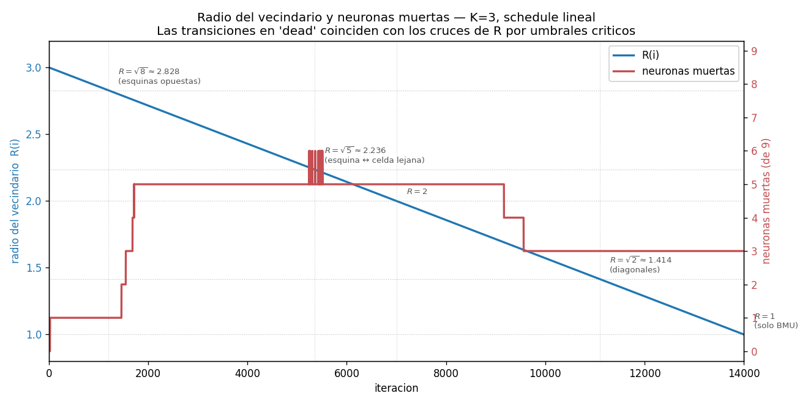

# Evolución temporal del SOM K=3 — qué pasa iteración por iteración

Experimento para responder: **¿por qué mueren las neuronas del centro de la grilla, si el learning rate ya es minúsculo después de las primeras ~100 iteraciones?**

Entrenamos el SOM K=3 (rectangular, R₀=K, η₀=0.5, schedule adaptativo, seed=2) grabando el estado en **cada una** de las 14 000 iteraciones. Los CSVs largos están en este directorio, y `visor.html` permite revisarlo con un slider.

## Lo que observé moviendo el slider

Tres cosas raras, en orden:

1. **De iter ~50 a iter ~1200 el heatmap de registros queda congelado.** Las 9 celdas tienen exactamente los mismos países asignados durante 1 150 iteraciones seguidas (`(0,1)` muerta desde temprano, las otras 8 con sus mismos países).

2. **Pero las distancias entre neuronas SÍ cambian.** En la matriz U se ve que durante esa fase "congelada", las distancias se van achicando suavemente para las neuronas que no son las dos esquinas vivas — el centro se vuelve cada vez más homogéneo. Los pesos del medio se están acercando entre sí.

3. **De iter ~1200 a iter ~1550 todo se desmorona de golpe.** En menos de 400 iteraciones se mueren 4 neuronas más, quedando solo las esquinas y un par de celdas con 1-2 países. Visualmente parece divergencia, pero η a esa altura es **~0.0004** — un valor minúsculo. **¿Cómo puede divergir tan rápido un sistema con learning rate así de chico?**

Eso es lo que no me cerraba, y es el disparador para la próxima sección.

## Diagnóstico: no es divergencia, es una bifurcación discreta del vecindario

La causa es geométrica y no tiene nada que ver con el learning rate. La clave está en el **schedule lineal del radio** combinado con la **vecindad dura** (`mask = D < R`, sin kernel suave).

### El número mágico: R = √8

Para una grilla rectangular K=3, la distancia máxima entre dos neuronas es de una esquina a la opuesta: `√(2² + 2²) = √8 ≈ 2.828`.

- **Si R > √8**, la mask del BMU es **toda la grilla**: cada iteración mueve las 9 celdas con el mismo `η · (x − W)` hacia la muestra elegida.
- **Si R ≤ √8**, las esquinas opuestas se desacoplan. Aparece la primera asimetría dinámica.

Con `R(i) = 3 − 2·(i−1)/13 999` (lineal de 3 a 1), ese cruce ocurre en **iter ≈ 1 202** — exactamente donde empieza la cascada que viste vos.

### Qué pasaba durante la fase "frozen" (iter 50 a 1200)

Mientras R > √8, **toda la grilla es vecindario del BMU**. Independientemente de qué BMU gane, las 9 celdas reciben el mismo update. Como las muestras se eligen uniformemente al azar, el atractor de largo plazo de ese sistema es **el centroide de los datos**.

→ Las 9 celdas driftean **juntas** hacia el centroide. Sus posiciones relativas casi no cambian (porque todas reciben el mismo empujón), por eso los BMUs no cambian y el heatmap parece congelado. Pero la matriz U sí muestra el achicamiento — los pesos del medio se acercan entre sí, exactamente como observaste.

QE crece lentamente de 2.29 a 2.40 en esa fase: como todas las celdas se mueven juntas hacia el centroide, se alejan de los países de las puntas (Ucrania, Luxemburgo, etc.).

### Qué pasa en iter ~1500: el desacople

Cuando R baja de √8, la mask deja de incluir la esquina opuesta del BMU. **Aparece la primera asimetría**:

- BMU en una esquina → pulls 8 celdas, deja libre la esquina opuesta.
- La esquina libre puede empezar a especializarse al cluster opuesto.

Las dos esquinas activas se "tiran" hacia clusters opuestos (oeste vs este). Las celdas del medio quedan tironeadas en direcciones contrarias → terminan en el centroide → **ningún país las elige como BMU** → mueren.

La cascada (1 → 5 muertas en 300 iteraciones) ocurre a pesar de que **η ≈ 0.0004**. Eso es porque los pesos venían "cargados" con 1200 iteraciones de drift acumulado hacia el centroide. El desacople libera esa energía latente.

### Más adelante: la recuperación parcial

Entre iter 9 500 y 11 000, R cruza √2 ≈ 1.414. Los vecinos diagonales se desacoplan. El vecindario se vuelve tan chico que el BMU casi no smearea sus updates → algunas celdas que quedaron marginalmente cerca de un cluster logran ganar asignaciones. Pasamos de 5 muertas a 3.

Esto no es "el SOM mejora": es simplemente que con vecindario chico hay menos averaging y se vuelven a ver algunos BMUs aislados.

### Cuadro de transiciones

| iter ≈ | R(i) cruza | qué deja de incluir el vecindario | efecto observado |
|---:|---:|---|---|
| 1 | 3.000 | — | mask = toda la grilla |
| **1 202** | **√8 ≈ 2.828** | esquina ↔ esquina opuesta | **cascada: 1 → 5 muertas** |
| 5 348 | √5 ≈ 2.236 | esquina ↔ celdas a 2 filas + 1 col | sin cambio fuerte |
| 7 000 | 2.000 | esquina ↔ otra punta de la fila | sin cambio fuerte |
| 9 500–11 000 | √2 ≈ 1.414 | vecinos diagonales | recuperación: 5 → 3 muertas |
| 14 000 | 1.000 | TODO menos el BMU | estado final |

### Plot



Eje izquierdo (azul): `R(i)`. Eje derecho (rojo): cantidad de neuronas muertas. Las líneas punteadas marcan los umbrales `√8, √5, 2, √2, 1` y la iteración en que se cruzan. La cascada de muertes coincide exactamente con el cruce de √8.

## Qué queda al final: el SOM colapsó al PC1

Una vez que se asienta el polvo (iter 14 000, después del colapso), las dos esquinas vivas concentran prácticamente todos los países, ordenados por distancia a su BMU. Mirando esa lista, se ve que **el SOM terminó reproduciendo el eje principal del dataset — esencialmente PC1**:

**Esquina `(0,2)` — 11 países (este + sur):**

> Hungary (1.04), Portugal (1.15), Poland (1.23), Slovakia (1.28), Lithuania (1.81), Croatia (2.13), Estonia (2.22), Latvia (2.28), Bulgaria (2.48), Greece (3.67), Ukraine (5.39)

**Esquina `(2,0)` — 12 países (núcleo occidental):**

> Denmark (1.05), Belgium (1.12), Italy (1.33), Netherlands (1.57), Austria (1.59), Germany (1.68), Sweden (1.86), Iceland (2.29), Norway (2.39), Ireland (2.39), Switzerland (3.10), Luxembourg (3.83)

Dos observaciones clave:

1. **El eje oeste–este coincide con PC1.** Comparado con el análisis de PCA que vive en `SIA-PCA/Notas/`, ese contraste — Europa occidental rica/estable vs Europa del este/sur con más inflación y desempleo — es exactamente la dirección de máxima varianza del dataset. El SOM con vecindad dura, schedule lineal y K chico está actuando como un cuantizador unidimensional sobre PC1.

2. **Dentro de cada esquina, las distancias a la BMU forman un gradiente.** En `(0,2)` los más cercanos (Hungría, Portugal, Polonia, Eslovaquia) son los más "promedio" de su lado del PC1, y los más lejanos (Grecia 3.67, Ucrania 5.39) son los outliers. Lo mismo en `(2,0)`: Dinamarca y Bélgica cerca, Luxemburgo y Suiza lejos. El SOM no descubre clusters dentro de cada lado — solo los ordena por *qué tan extremos* son en PC1.

Esto refuerza lo que veníamos sospechando: con esta configuración no estamos haciendo *clustering bidimensional*, estamos haciendo una proyección 1D al eje dominante. Las celdas del centro de la grilla, que podrían haber capturado direcciones secundarias del dataset (PC2 — quizás el contraste norte/sur o tamaño/poblacional) se murieron antes de poder hacerlo. Eso explica por qué el resultado parece "solo dos clusters" en lugar de los 5-8 que el dataset probablemente sostiene.

## Conclusión

Lo que parecía "divergencia con η minúsculo" es en realidad una **bifurcación topológica**: el schedule lineal de R cruza umbrales geométricos discretos de la grilla, y cada cruce cambia bruscamente la estructura de acoplamiento entre neuronas.

Esto es una propiedad inherente del setup:
- **vecindad dura** (`mask = D < R`)
- **schedule lineal de R**
- **grilla chica** (con K=3, hay muy pocos umbrales y están bien separados)

En SOMs estándar se usa **kernel gaussiano** en vez de mask dura — eso elimina los umbrales discretos y la transición es suave. La cátedra usa mask dura, así que estás viendo el comportamiento característico de ese recipe, no un bug.

### Validación de la hipótesis del barrido

En `barrido K primer intento/Resultados.md` planteamos que *"las neuronas muertas no son víctimas de neuronas dominantes, son neuronas cuyos pesos quedaron atrapados en zona vacía del espacio"*. Este experimento confirma exactamente eso, y además identifica el mecanismo: el atrapamiento se produce por el **drift colectivo hacia el centroide** durante la fase frozen, y se hace irreversible cuando el desacople de R = √8 deja a las celdas del medio sin forma de salir.

## Archivos en este directorio

| Archivo | Contenido |
|---|---|
| `snapshot_k3.py` | entrena K=3 grabando cada iteración |
| `weights_evolution.csv` | (largo) iter, i, j, var1..var7 — 126 009 filas |
| `assignments_evolution.csv` | (largo) iter, country, i, j, dist — 392 028 filas |
| `som_data.js` | datos sub-sampleados para el visor (276 frames) |
| `visor.html` | slider interactivo con heatmap + matriz U + lista de países |
| `plot_R_vs_dead.py` | genera el plot R y dead vs iter |
| `R_vs_dead.png` | plot del análisis de transiciones |

## Cómo regenerar

```bash
cd "kohonen/experimentos/evolucion K3"
python3 snapshot_k3.py    # ~7 segundos
python3 plot_R_vs_dead.py # ~1 segundo
open visor.html
```
